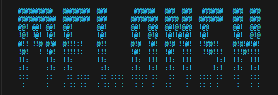

# MelonShell



A minimal Unix shell written in C, implementing command parsing and interpretation with support for sequences, pipelines, I/O redirection, background jobs, and several built-in commands.

## Features

- **Simple commands** — execute external programs via `fork`/`exec`
- **Command sequences** — semicolon (`;`) and background (`&`) separators
- **Pipelines** — chain commands with `|`
- **I/O redirection** — `< infile` and `> outfile`
- **Background jobs** — run pipelines in the background with `&`
- **Built-in commands** — `cd`, `pwd`, `exit`, `history`
- **Command history** — persisted in `.history` via GNU Readline

## Startup Experience

When launched interactively, MelonShell displays:

1. **ASCII art banner** — randomly selected from 11 art files in `ascii/`
2. **Time-of-day greeting** — "Good morning/afternoon/evening, \<user\>!"
3. **System info panel** — date/time, user, host, kernel, arch, uptime, memory, CPU, color support

## Grammar

```
sequence ::= pipeline | pipeline & | pipeline ; | pipeline & sequence | pipeline ; sequence
pipeline ::= command | command | pipeline
command  ::= words redir
words    ::= word | words word
redir    ::= ε | < word | > word | < word > word
```

## Architecture

| File | Purpose |
|---|---|
| `Shell.c` | Main read-eval-print loop (Readline integration, history) |
| `Scanner.c / .h` | Tokenizer — splits input into words and operators |
| `Parser.c / .h` | Recursive-descent parser — builds an AST from tokens |
| `Tree.c / .h` | AST node definitions and `freeTree` |
| `Interpreter.c / .h` | Walks the AST, builds Sequence/Pipeline/Command objects, executes |
| `Sequence.c / .h` | Ordered list of pipelines with fg/bg tracking |
| `Pipeline.c / .h` | Ordered list of commands; pipe plumbing |
| `Command.c / .h` | Single command: argv construction, fork/exec, builtins, redirection |
| `Jobs.c / .h` | Background job tracking via a deque |
| `deq.h` | Double-ended queue (shared library `libdeq.so`) |
| `error.h` | Error-reporting macros |
| `ascii/` | 11 ASCII art banner files (`1.txt`–`11.txt`), randomly displayed at startup |

## Building

```bash
make          # builds the 'melonsh' executable and libdeq.so
```

Requires GNU Readline (`-lreadline -lncurses`).

## Running

```bash
./melonsh               # interactive mode (with prompt "$ ")
./melonsh < commands.txt # batch/scripted mode
```

## Testing

An automated test suite lives in `Test/`. Each `Test_*` directory contains an `inp` (input) file and an `exp` (expected output) file.

```bash
make test       # runs all tests via Test/run
make valgrind   # runs all tests under Valgrind with leak checking
```

### Test categories

| Tests | Area |
|---|---|
| 1a–1d | Simple commands and echo |
| 2a–2c | Command sequences (`;`, multi-line) |
| 3a–3c | I/O redirection (`<`, `>`, both) |
| 4a–4b | Background jobs (`&`) |
| 5a–5c | Pipelines (`\|`) |
| 6a–6e | Builtins: `cd`, `pwd`, `exit`, `history` |

## Cleanup

```bash
make clean      # removes object files and the shell binary
```
